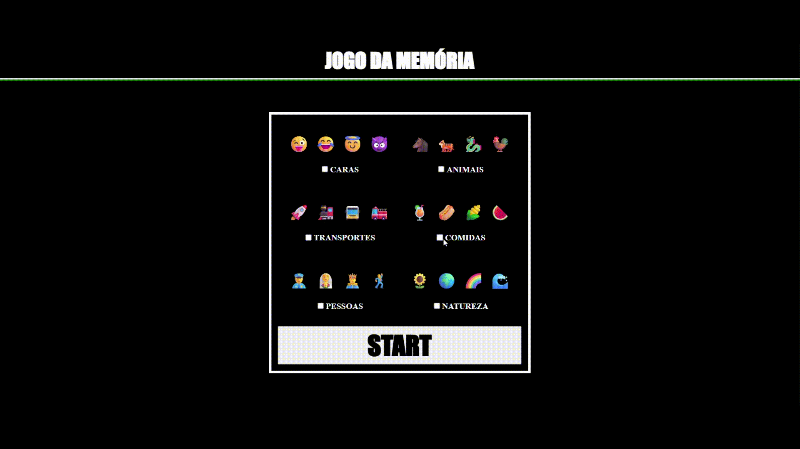

## 🎮 JSGame Jogo da Memória

  

Bem-vindo ao **JSGame Jogo da Memória**! Neste repositório, você encontrará um jogo simples e divertido para jogar com seus amigos, inspirado no clássico *Jogo da Memória*.

🎲 **[Clique aqui para jogar agora](https://ismaelldiias.github.io/jsgame-jogo-da-memoria/)**

---

## 🎯 Objetivo

Acertar o maior número possível de pares de emojis.

---

## 🛠️ Tecnologias Utilizadas

- **HTML5** e **CSS3** – Estrutura e aparência do jogo  
- **JavaScript** – Lógica do jogo e interatividade

---

## 🚀 Como Jogar

1. Clone este repositório para sua máquina local.  
2. Abra o arquivo `index.html` em seu navegador web.  
3. Primeiramente, escolha os grupos de emojis com os quais deseja jogar.  
4. Individualmente ou em grupo, cada pessoa deve, em sua vez, escolher e clicar em um **par de cartas** para que sejam viradas e, assim, verificar se são iguais (se possuem o mesmo emoji):  
   - Se as cartas **não forem iguais**, elas são desviradas e a vez passa para a próxima pessoa.  
   - Se as cartas **forem iguais**, elas permanecem viradas e perdem o fundo para indicar que já foram acertadas, e a pessoa pode jogar novamente.  
5. O jogo encerra quando todas as cartas forem viradas/acertadas.  
6. Para jogar novamente, basta atualizar a página (**F5**).  

---

## 🤝 Contribuição

Contribuições são muito bem-vindas! Se você deseja melhorar o jogo, adicionar novos recursos ou corrigir bugs, fique à vontade para abrir um **pull request**.
